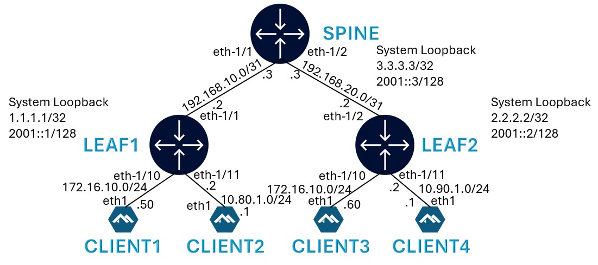
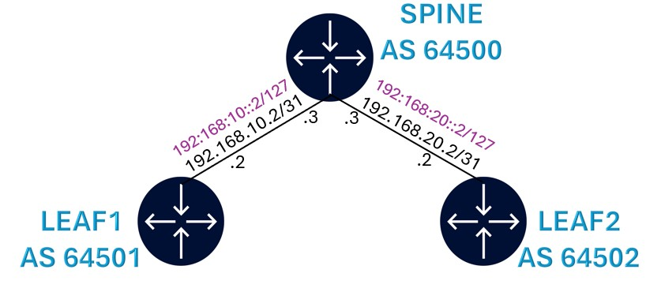
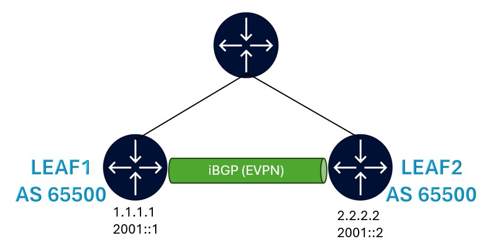
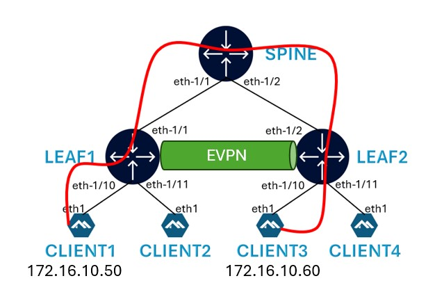
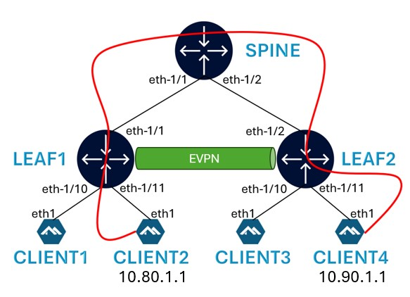
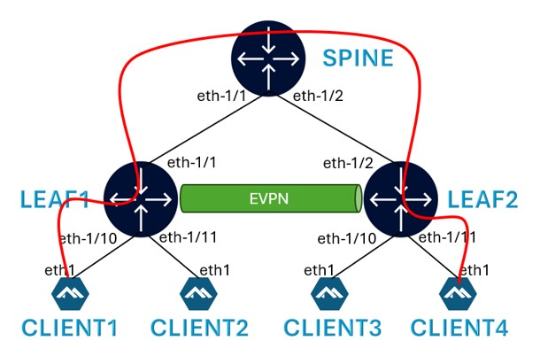

# Welcome to the EVPN Workshop at NANOG 92
This README is your starting point into the hands on section.

Pre-requisite: A laptop with SSH client

If you need help, please raise your hand and a Nokia team member will be happy to assist.

## Lab Environment

A Nokia team member will provide you with a sheet that contains:
- your group and VM ID
- SSH credentials to the VM instance
- URL of this repo

> <p style="color:red">!!! Make sure to backup any code, config, ... <u> offline (e.g on your laptop)</u>. 
> The VM instances might be destroyed once the Workshop is concluded.</p>

# Workshop
The objective of the handson section of this workshop is the following:
- Build a DC fabric with leaf and spine
- Build Layer 2 EVPN
- Build Layer 3 EVPN

## Lab Topology

Each workshop participant will be provided the below topology consisting of 2 leaf and 1 spine nodes along with 4 clients.


## NOS (Network Operating System)

Both leafs and Spine nodes will be running Nokia [SR Linux](https://www.nokia.com/networks/ip-networks/service-router-linux-NOS/).

All 4 clients will be runnin [Alpine Linux](https://alpinelinux.org/)

## Deploying the lab

Login to the VM using the credentials on your sheet.

This Git repo is already cloned to your VM.

But in case you need it, use the below command to clone this repo to your VM.

```
git clone https://github.com/srlinuxamericas/N92-evpn.git
```

Verify that this git repo files are now available on your VM.

```
ls -lrt N92-evpn/n92-evpn-lab/
```

To deploy the lab, run the following:

```
cd N92-evpn
sudo clab deploy -t n92-evpn-lab/srl-evpn.clab.yml
```

[Containerlab](https://containerlab.dev/) will deploy the lab and display a table with the list of nodes and their IPs.

To display current deployed labs at any time, use:

```
sudo clab inspect --all
```

## Connecting to the devices

Find the nodename or IP address of the device and then use SSH.

Username: `admin`

Password: Refer to the provided sheet

```
ssh admin@clab-srl-evpn-leaf1
```

To login to the client, identify the client hostname using the `clab inspect` command above and then:

```
sudo docker exec –it clab-srl-evpn-client3 sh
```

## Physical link connectivity

When the lab is deployed with the default startup config, all the links are created with IPv4 and IPv6 addresses.

This allows to start configuring the protocols right away!

Check the [startup config](n92-evpn-lab/configs/fabric/startup) files to see how interfaces and IP addresses are configured in SR Linux.

### IPv4 Link Addressing



### IPv6 Link Addressing


### Verify reachability between devices

After the lab is deployed, check reachability between leaf and spine devices using ping.

Example on spine to Leaf1 for IPv4:

```
ping -c 3 192.168.10.2 network-instance default
```

Example on spine to Leaf1 for IPv6:

```
ping6 -c 3 192:168:10::2 network-instance default
```

## Configure BGP Underlay

We are now ready to start configuring the fabric for EVPN.

The first step is to configure BGP for underlay.



### SR Linux Configuration Mode

To enter candidate configuration edit mode in SR Linux, use:

```
enter candidate
```

To commit the configuration in SR Linux, use:

```
commit stay
```

### BGP Underlay Configuration

BGP underlay configuration on Leaf1:

```
set / network-instance default protocols bgp autonomous-system 64501
set / network-instance default protocols bgp router-id 1.1.1.1
set / network-instance default protocols bgp ebgp-default-policy import-reject-all false
set / network-instance default protocols bgp ebgp-default-policy export-reject-all false
set / network-instance default protocols bgp afi-safi ipv4-unicast admin-state enable
set / network-instance default protocols bgp group ebgp peer-as 64500
set / network-instance default protocols bgp group ebgp afi-safi ipv6-unicast admin-state enable
set / network-instance default protocols bgp neighbor 192.168.10.3 peer-group ebgp
set / network-instance default protocols bgp neighbor 192.168.10.3 export-policy [ export-underlay-v4 ]
set / network-instance default protocols bgp neighbor 192.168.10.3 afi-safi ipv6-unicast admin-state disable
set / network-instance default protocols bgp neighbor 192:168:10::3 peer-group ebgp
set / network-instance default protocols bgp neighbor 192:168:10::3 export-policy [ export-underlay-v6 ]
set / network-instance default protocols bgp neighbor 192:168:10::3 afi-safi ipv4-unicast admin-state disable
```

BGP underlay configuration on Leaf2:

```
set / network-instance default protocols bgp autonomous-system 64502
set / network-instance default protocols bgp router-id 2.2.2.2
set / network-instance default protocols bgp ebgp-default-policy import-reject-all false
set / network-instance default protocols bgp ebgp-default-policy export-reject-all false
set / network-instance default protocols bgp afi-safi ipv4-unicast admin-state enable
set / network-instance default protocols bgp group ebgp peer-as 64500
set / network-instance default protocols bgp group ebgp afi-safi ipv6-unicast admin-state enable
set / network-instance default protocols bgp neighbor 192.168.20.3 peer-group ebgp
set / network-instance default protocols bgp neighbor 192.168.20.3 export-policy [ export-underlay-v4 ]
set / network-instance default protocols bgp neighbor 192.168.20.3 afi-safi ipv6-unicast admin-state disable
set / network-instance default protocols bgp neighbor 192:168:20::3 peer-group ebgp
set / network-instance default protocols bgp neighbor 192:168:20::3 export-policy [ export-underlay-v6 ]
set / network-instance default protocols bgp neighbor 192:168:20::3 afi-safi ipv4-unicast admin-state disable
```

BGP underlay configuration on Spine:

```
set / network-instance default protocols bgp autonomous-system 64500
set / network-instance default protocols bgp router-id 3.3.3.3
set / network-instance default protocols bgp ebgp-default-policy import-reject-all false
set / network-instance default protocols bgp ebgp-default-policy export-reject-all false
set / network-instance default protocols bgp afi-safi ipv4-unicast admin-state enable
set / network-instance default protocols bgp group ebgp afi-safi ipv6-unicast admin-state enable
set / network-instance default protocols bgp neighbor 192.168.10.2 peer-as 64501
set / network-instance default protocols bgp neighbor 192.168.10.2 peer-group ebgp
set / network-instance default protocols bgp neighbor 192.168.10.2 afi-safi ipv6-unicast admin-state disable
set / network-instance default protocols bgp neighbor 192.168.20.2 peer-as 64502
set / network-instance default protocols bgp neighbor 192.168.20.2 peer-group ebgp
set / network-instance default protocols bgp neighbor 192.168.20.2 afi-safi ipv6-unicast admin-state disable
set / network-instance default protocols bgp neighbor 192:168:10::2 peer-as 64501
set / network-instance default protocols bgp neighbor 192:168:10::2 peer-group ebgp
set / network-instance default protocols bgp neighbor 192:168:10::2 afi-safi ipv4-unicast admin-state disable
set / network-instance default protocols bgp neighbor 192:168:20::2 peer-as 64502
set / network-instance default protocols bgp neighbor 192:168:20::2 peer-group ebgp
set / network-instance default protocols bgp neighbor 192:168:20::2 afi-safi ipv4-unicast admin-state disable
```

### BGP Underlay Verification

The BGP underlay sessions should be UP now. Check using the following commands on the Spine.

```
show network-instance default protocols bgp neighbor
```

The output confirms that both IPv4 and IPv6 BGP neighbor sessions are established.

```
A:spine# show network-instance default protocols bgp neighbor
----------------------------------------------------------------------------------------------------------------------------------------------------------------------------
BGP neighbor summary for network-instance "default"
Flags: S static, D dynamic, L discovered by LLDP, B BFD enabled, - disabled, * slow
----------------------------------------------------------------------------------------------------------------------------------------------------------------------------
----------------------------------------------------------------------------------------------------------------------------------------------------------------------------
+-------------------+---------------------------+-------------------+-------+----------+---------------+---------------+--------------+---------------------------+
|     Net-Inst      |           Peer            |       Group       | Flags | Peer-AS  |     State     |    Uptime     |   AFI/SAFI   |      [Rx/Active/Tx]       |
+===================+===========================+===================+=======+==========+===============+===============+==============+===========================+
| default           | 192.168.10.2              | ebgp              | S     | 64501    | established   | 0d:0h:27m:40s | ipv4-unicast | [1/1/1]                   |
| default           | 192.168.20.2              | ebgp              | S     | 64502    | established   | 0d:0h:27m:40s | ipv4-unicast | [1/1/1]                   |
| default           | 192:168:10::2             | ebgp              | S     | 64501    | established   | 0d:0h:27m:45s | ipv6-unicast | [1/1/1]                   |
| default           | 192:168:20::2             | ebgp              | S     | 64502    | established   | 0d:0h:27m:45s | ipv6-unicast | [1/1/1]                   |
+-------------------+---------------------------+-------------------+-------+----------+---------------+---------------+--------------+---------------------------+
----------------------------------------------------------------------------------------------------------------------------------------------------------------------------
Summary:
4 configured neighbors, 4 configured sessions are established, 0 disabled peers
0 dynamic peers
```

## Configure BGP for Overlay

BGP is required to advertise EVPN routes between the leaf devices.

For establishing overlay BGP neighbors, we will use the system loopback IP of the Leaf nodes. These IPs are pre-configured as part of initial lab deployment and can be verified using `show interface system0` command.

BGP overlay configuration is not required on the Spine as Spine is not aware of EVPN routes.



### BGP Overlay Configuration

BGP Overlay configuration on Leaf1:

```
set / network-instance default protocols bgp group evpn peer-as 65500
set / network-instance default protocols bgp group evpn multihop admin-state enable
set / network-instance default protocols bgp group evpn afi-safi evpn admin-state enable
set / network-instance default protocols bgp group evpn afi-safi ipv4-unicast admin-state disable
set / network-instance default protocols bgp group evpn afi-safi ipv6-unicast admin-state disable
set / network-instance default protocols bgp group evpn local-as as-number 65500
set / network-instance default protocols bgp neighbor 2.2.2.2 peer-group evpn
set / network-instance default protocols bgp neighbor 2.2.2.2 transport local-address 1.1.1.1
set / network-instance default protocols bgp neighbor 2001::2 peer-group evpn
set / network-instance default protocols bgp neighbor 2001::2 transport local-address 2001::1
```

BGP Overlay configuration on Leaf2:

```
set / network-instance default protocols bgp group evpn peer-as 65500
set / network-instance default protocols bgp group evpn multihop admin-state enable
set / network-instance default protocols bgp group evpn afi-safi evpn admin-state enable
set / network-instance default protocols bgp group evpn afi-safi ipv4-unicast admin-state disable
set / network-instance default protocols bgp group evpn afi-safi ipv6-unicast admin-state disable
set / network-instance default protocols bgp group evpn local-as as-number 65500
set / network-instance default protocols bgp neighbor 1.1.1.1 peer-group evpn
set / network-instance default protocols bgp neighbor 1.1.1.1 transport local-address 2.2.2.2
set / network-instance default protocols bgp neighbor 2001::1 peer-group evpn
set / network-instance default protocols bgp neighbor 2001::1 transport local-address 2001::2
```

### BGP Overlay Verification

The BGP overlay sessions should be UP now. Check using the following commands on Leaf1 or Leaf2.

```
show network-instance default protocols bgp neighbor
```

The output confirms that EVPN neigbor sessions are established to both the IPv4 and IPv6 loopback IPs.
The output also displays the underlay IPv4 and IPv6 sessions.

```
A:leaf1# show network-instance default protocols bgp neighbor
----------------------------------------------------------------------------------------------------------------------------------------------------------------------------
BGP neighbor summary for network-instance "default"
Flags: S static, D dynamic, L discovered by LLDP, B BFD enabled, - disabled, * slow
----------------------------------------------------------------------------------------------------------------------------------------------------------------------------
----------------------------------------------------------------------------------------------------------------------------------------------------------------------------
+-------------------+---------------------------+-------------------+-------+----------+---------------+---------------+--------------+---------------------------+
|     Net-Inst      |           Peer            |       Group       | Flags | Peer-AS  |     State     |    Uptime     |   AFI/SAFI   |      [Rx/Active/Tx]       |
+===================+===========================+===================+=======+==========+===============+===============+==============+===========================+
| default           | 2.2.2.2                   | evpn              | S     | 65500    | established   | 0d:0h:26m:26s | evpn         | [0/0/0]                   |
| default           | 192.168.10.3              | ebgp              | S     | 64500    | established   | 0d:0h:26m:36s | ipv4-unicast | [1/1/1]                   |
| default           | 192:168:10::3             | ebgp              | S     | 64500    | established   | 0d:0h:26m:41s | ipv6-unicast | [1/1/1]                   |
| default           | 2001::2                   | evpn              | S     | 65500    | established   | 0d:0h:26m:27s | evpn         | [0/0/0]                   |
+-------------------+---------------------------+-------------------+-------+----------+---------------+---------------+--------------+---------------------------+
----------------------------------------------------------------------------------------------------------------------------------------------------------------------------
Summary:
4 configured neighbors, 4 configured sessions are established, 0 disabled peers
0 dynamic peers
```

## Configure L2 EVPN-VXLAN

Now that we have established our underlay and overlay connectivity, our next step is to configure the Layer 2 EVPN-VXLAN instance.

The objective is to establish a connection between Client 1 (connected to Leaf1) and Client 3 (connected to Leaf2).



### Configure Client Interface

Client Layer 2 interface configuration on Leaf1:

```
set / interface ethernet-1/10 description To-Client1
set / interface ethernet-1/10 subinterface 0 type bridged
```

Client Layer 2 interface configuration on Leaf2:

```
set / interface ethernet-1/10 description To-Client3
set / interface ethernet-1/10 subinterface 0 type bridged
```

IP addresses on the client side are pre-configured during deployment. This can be verified by logging to the Client shell and running `ip a`.

To login to Client1, use:
```
docker exec -it clab-srl-evpn-client1 sh
```

Output on Client1:

```
/ # ip a
<--truncated-->
20: eth1@if19: <BROADCAST,MULTICAST,UP,LOWER_UP,M-DOWN> mtu 9500 qdisc noqueue state UP
    link/ether aa:c1:ab:81:49:35 brd ff:ff:ff:ff:ff:ff
    inet 172.16.10.50/24 scope global eth1
       valid_lft forever preferred_lft forever
    inet6 fe80::a8c1:abff:fe81:4935/64 scope link
       valid_lft forever preferred_lft forever
```

### Configuring VXLAN

Configuring VXLAN on Leaf1:

```
set / tunnel-interface vxlan13 vxlan-interface 100 type bridged
set / tunnel-interface vxlan13 vxlan-interface 100 ingress vni 100
```

Configuring VXLAN on Leaf2:

```
set / tunnel-interface vxlan13 vxlan-interface 100 type bridged
set / tunnel-interface vxlan13 vxlan-interface 100 ingress vni 100
```

### Configuring Layer 2 EVPN-VXLAN

Layer 2 instance on SR Linux is called MAC-VRF.

EVPN-VXLAN configuration on Leaf1:

```
set / network-instance mac-vrf-1 type mac-vrf
set / network-instance mac-vrf-1 interface ethernet-1/10.0
set / network-instance mac-vrf-1 vxlan-interface vxlan13.100
set / network-instance mac-vrf-1 protocols bgp-evpn bgp-instance 1 encapsulation-type vxlan
set / network-instance mac-vrf-1 protocols bgp-evpn bgp-instance 1 vxlan-interface vxlan13.100
set / network-instance mac-vrf-1 protocols bgp-evpn bgp-instance 1 evi 100
set / network-instance mac-vrf-1 protocols bgp-vpn bgp-instance 1 route-distinguisher rd 1.1.1.1:100
set / network-instance mac-vrf-1 protocols bgp-vpn bgp-instance 1 route-target export-rt target:65500:100
set / network-instance mac-vrf-1 protocols bgp-vpn bgp-instance 1 route-target import-rt target:65500:100
```

EVPN-VXLAN configuration on Leaf2:

```
set / network-instance mac-vrf-1 type mac-vrf
set / network-instance mac-vrf-1 interface ethernet-1/10.0
set / network-instance mac-vrf-1 vxlan-interface vxlan13.100
set / network-instance mac-vrf-1 protocols bgp-evpn bgp-instance 1 encapsulation-type vxlan
set / network-instance mac-vrf-1 protocols bgp-evpn bgp-instance 1 vxlan-interface vxlan13.100
set / network-instance mac-vrf-1 protocols bgp-evpn bgp-instance 1 evi 100
set / network-instance mac-vrf-1 protocols bgp-vpn bgp-instance 1 route-distinguisher rd 2.2.2.2:100
set / network-instance mac-vrf-1 protocols bgp-vpn bgp-instance 1 route-target export-rt target:65500:100
set / network-instance mac-vrf-1 protocols bgp-vpn bgp-instance 1 route-target import-rt target:65500:100
```

### EVPN verification

EVPN will advertise Route Type 3 Inclusive Multicast Ethernet Tag (IMET) to discover PE devices and setup tree for BUM traffic.

This route advertisement can be seen in the BGP show output using the below command.

```
show network-instance default protocols bgp routes evpn route-type summary
```

Output on Leaf1:
```
A:leaf1# show network-instance default protocols bgp routes evpn route-type summary
-------------------------------------------------------------------------------------------------------------------------------------------------------------------
Show report for the BGP route table of network-instance "default"
-------------------------------------------------------------------------------------------------------------------------------------------------------------------
Status codes: u=used, *=valid, >=best, x=stale
Origin codes: i=IGP, e=EGP, ?=incomplete
-------------------------------------------------------------------------------------------------------------------------------------------------------------------
BGP Router ID: 1.1.1.1      AS: 64501      Local AS: 64501
-------------------------------------------------------------------------------------------------------------------------------------------------------------------
Type 3 Inclusive Multicast Ethernet Tag Routes
+--------+--------------------------------------+------------+---------------------+--------------------------------------+--------------------------------------+
| Status |         Route-distinguisher          |   Tag-ID   |    Originator-IP    |               neighbor               |               Next-Hop               |
+========+======================================+============+=====================+======================================+======================================+
| u*>    | 2.2.2.2:100                          | 0          | 2.2.2.2             | 2.2.2.2                              | 2.2.2.2                              |
| *      | 2.2.2.2:100                          | 0          | 2.2.2.2             | 2001::2                              | 2.2.2.2                              |
+--------+--------------------------------------+------------+---------------------+--------------------------------------+--------------------------------------+
-------------------------------------------------------------------------------------------------------------------------------------------------------------------
0 Ethernet Auto-Discovery routes 0 used, 0 valid
0 MAC-IP Advertisement routes 0 used, 0 valid
2 Inclusive Multicast Ethernet Tag routes 1 used, 2 valid
0 Ethernet Segment routes 0 used, 0 valid
0 IP Prefix routes 0 used, 0 valid
0 Selective Multicast Ethernet Tag routes 0 used, 0 valid
0 Selective Multicast Membership Report Sync routes 0 used, 0 valid
0 Selective Multicast Leave Sync routes 0 used, 0 valid
```

### Ping between Client 1 & 3

Verify if Client 3 is able to ping Client 1

Login to Client3 using:
```
sudo docker exec -it clab-srl-evpn-client3 sh
```

Run `ip a` and note down the MAC address of eth1 interface (facing Leaf2).

```
# docker exec -it clab-srl-evpn-client3 sh
/ # ip a
26: eth1@if25: <BROADCAST,MULTICAST,UP,LOWER_UP,M-DOWN> mtu 9500 qdisc noqueue state UP
    link/ether aa:c1:ab:67:32:61 brd ff:ff:ff:ff:ff:ff
    inet 172.16.10.60/24 scope global eth1
       valid_lft forever preferred_lft forever
    inet6 fe80::a8c1:abff:fe3f:aed8/64 scope link
       valid_lft forever preferred_lft forever
/ #
```

The MAC address of Client3 eth1 interface is aa:c1:ab:67:32:61.

Ping Client1 IP from Client3:

```
ping -c 1 172.16.10.50
```

```
/ # ping -c 1 172.16.10.50
PING 172.16.10.50 (172.16.10.50): 56 data bytes
64 bytes from 172.16.10.50: seq=0 ttl=64 time=0.886 ms

--- 172.16.10.50 ping statistics ---
1 packets transmitted, 1 packets received, 0% packet loss
round-trip min/avg/max = 0.886/0.886/0.886 ms
```

Ping is successful. We have now established a Layer2 EVPN connection between Client1 & Client3.

Now let's verify the MAC-IP advertisement using EVPN Route Type 2.

Run the below command on Leaf1 to see this route advertisement. Verify if the MAC address in the table below is the same MAC address we noted above for Client3.

```
show network-instance default protocols bgp routes evpn route-type summary
```

Output on Leaf1:

```
A:leaf1# show network-instance default protocols bgp routes evpn route-type summary
----------------------------------------------------------------------------------------------------------------------------------------------------------------------------------------------
Show report for the BGP route table of network-instance "default"
----------------------------------------------------------------------------------------------------------------------------------------------------------------------------------------------
Status codes: u=used, *=valid, >=best, x=stale
Origin codes: i=IGP, e=EGP, ?=incomplete
----------------------------------------------------------------------------------------------------------------------------------------------------------------------------------------------
BGP Router ID: 1.1.1.1      AS: 64501      Local AS: 64501
----------------------------------------------------------------------------------------------------------------------------------------------------------------------------------------------
Type 2 MAC-IP Advertisement Routes
+--------+------------------+------------+-------------------+------------------+------------------+------------------+------------------+--------------------------------+------------------+
| Status |      Route-      |   Tag-ID   |    MAC-address    |    IP-address    |     neighbor     |     Next-Hop     |      Label       |              ESI               |   MAC Mobility   |
|        |  distinguisher   |            |                   |                  |                  |                  |                  |                                |                  |
+========+==================+============+===================+==================+==================+==================+==================+================================+==================+
| u*>    | 2.2.2.2:100      | 0          | AA:C1:AB:67:32:61 | 0.0.0.0          | 2.2.2.2          | 2.2.2.2          | 100              | 00:00:00:00:00:00:00:00:00:00  | -                |
| *      | 2.2.2.2:100      | 0          | AA:C1:AB:67:32:61 | 0.0.0.0          | 2001::2          | 2.2.2.2          | 100              | 00:00:00:00:00:00:00:00:00:00  | -                |
+--------+------------------+------------+-------------------+------------------+------------------+------------------+------------------+--------------------------------+------------------+
```

Verify the MAC Address table using the below command.

```
show network-instance mac-vrf-1 bridge-table mac-table all
```

Output on Leaf1:

```
A:leaf1# show network-instance mac-vrf-1 bridge-table mac-table all
----------------------------------------------------------------------------------------------------------------------------------------------------------------------------------------------
Mac-table of network instance mac-vrf-1
----------------------------------------------------------------------------------------------------------------------------------------------------------------------------------------------
+--------------------+------------------------------------------------------+------------+----------------+---------+--------+------------------------------------------------------+
|      Address       |                     Destination                      | Dest Index |      Type      | Active  | Aging  |                     Last Update                      |
+====================+======================================================+============+================+=========+========+======================================================+
| AA:C1:AB:67:32:61  | vxlan-interface:vxlan13.100 vtep:2.2.2.2 vni:100     | 2736993    | evpn           | true    | N/A    | 2024-10-17T04:46:04.000Z                             |
| AA:C1:AB:81:49:35  | ethernet-1/10.0                                      | 2          | learnt         | true    | 76     | 2024-10-17T04:46:00.000Z                             |
+--------------------+------------------------------------------------------+------------+----------------+---------+--------+------------------------------------------------------+
```

### Debug and Packet Capture in SR Linux

SR Linux provides tools in CLI to capture packets for debug purposes.

Run the below command on Spine while a ping test is in progress between Client1 and Client3.

The output shows VXLAN encapsulated ICMP packets being sent between the 2 clients.

```
tools system traffic-monitor verbose protocol udp destination-port 4789
```

In this command, port 4789 is standard port for VXLAN.

### Packet Capture in Containerlab

Containerlab provides the ability to do a packet capture and re-direct the captured packets to Wireshark.

Visit [Containerlab page](https://containerlab.dev/manual/wireshark/) to learn more.

## Configure Layer 3 EVPN-VXLAN

Our final step is to configure a Layer 3 EVPN-VXLAN.

The objective is to connect Client 2 and Client 4 over a Layer 3 EVPN.



### Configure Client Interface

Client Layer 3 interface configuration on Leaf1:

```
set / interface ethernet-1/11 description To-Client2
set / interface ethernet-1/11 admin-state enable
set / interface ethernet-1/11 subinterface 0 ipv4 admin-state enable
set / interface ethernet-1/11 subinterface 0 ipv4 address 10.80.1.2/24
set / interface ethernet-1/11 subinterface 0 ipv6 admin-state enable
set / interface ethernet-1/11 subinterface 0 ipv6 address 10:80:1::2/64
```

Client Layer 3 interface configuration on Leaf2:

```
set / interface ethernet-1/11 description To-Client4
set / interface ethernet-1/11 admin-state enable
set / interface ethernet-1/11 subinterface 0 ipv4 admin-state enable
set / interface ethernet-1/11 subinterface 0 ipv4 address 10.90.1.2/24
set / interface ethernet-1/11 subinterface 0 ipv6 admin-state enable
set / interface ethernet-1/11 subinterface 0 ipv6 address 10:90:1::2/64
```

IP addresses on the client side are pre-configured during deployment. This can be verified by logging to the Client shell and running `ip a`.

### Configuring VXLAN

Configuring VXLAN on Leaf1:

```
set / tunnel-interface vxlan24 vxlan-interface 200 type routed
set / tunnel-interface vxlan24 vxlan-interface 200 ingress vni 200
```

Configuring VXLAN on Leaf2:

```
set / tunnel-interface vxlan24 vxlan-interface 200 type routed
set / tunnel-interface vxlan24 vxlan-interface 200 ingress vni 200
```

### Configuring Layer 3 EVPN-VXLAN

Layer 3 instance on SR Linux is called IP-VRF.

EVPN-VXLAN configuration on Leaf1:

```
set / network-instance ip-vrf-1 type ip-vrf
set / network-instance ip-vrf-1 admin-state enable
set / network-instance ip-vrf-1 interface ethernet-1/11.0
set / network-instance ip-vrf-1 vxlan-interface vxlan24.200
set / network-instance ip-vrf-1 protocols bgp-evpn bgp-instance 1 encapsulation-type vxlan
set / network-instance ip-vrf-1 protocols bgp-evpn bgp-instance 1 vxlan-interface vxlan24.200
set / network-instance ip-vrf-1 protocols bgp-evpn bgp-instance 1 evi 200
set / network-instance ip-vrf-1 protocols bgp-vpn bgp-instance 1 route-distinguisher rd 1.1.1.1:200
set / network-instance ip-vrf-1 protocols bgp-vpn bgp-instance 1 route-target export-rt target:65500:200
set / network-instance ip-vrf-1 protocols bgp-vpn bgp-instance 1 route-target import-rt target:65500:200
```

EVPN-VXLAN configuration on Leaf2:

```
set / network-instance ip-vrf-1 type ip-vrf
set / network-instance ip-vrf-1 admin-state enable
set / network-instance ip-vrf-1 interface ethernet-1/11.0
set / network-instance ip-vrf-1 vxlan-interface vxlan24.200
set / network-instance ip-vrf-1 protocols bgp-evpn bgp-instance 1 encapsulation-type vxlan
set / network-instance ip-vrf-1 protocols bgp-evpn bgp-instance 1 vxlan-interface vxlan24.200
set / network-instance ip-vrf-1 protocols bgp-evpn bgp-instance 1 evi 200
set / network-instance ip-vrf-1 protocols bgp-vpn bgp-instance 1 route-distinguisher rd 2.2.2.2:200
set / network-instance ip-vrf-1 protocols bgp-vpn bgp-instance 1 route-target export-rt target:65500:200
set / network-instance ip-vrf-1 protocols bgp-vpn bgp-instance 1 route-target import-rt target:65500:200
```

### Layer 3 EVPN Route Verification

In Layer 3 EVPN, Route Type 5 is used to advertise IP prefixes.

This can verified using the below command.

```
show network-instance default protocols bgp routes evpn route-type summary
```

Output on Leaf1:

```
A:leaf1# show network-instance default protocols bgp routes evpn route-type summary
----------------------------------------------------------------------------------------------------------------------------------------------------------------------------------------------
Show report for the BGP route table of network-instance "default"
----------------------------------------------------------------------------------------------------------------------------------------------------------------------------------------------
Status codes: u=used, *=valid, >=best, x=stale
Origin codes: i=IGP, e=EGP, ?=incomplete
----------------------------------------------------------------------------------------------------------------------------------------------------------------------------------------------
Type 5 IP Prefix Routes
+--------+----------------------------+------------+---------------------+----------------------------+----------------------------+----------------------------+----------------------------+
| Status |    Route-distinguisher     |   Tag-ID   |     IP-address      |          neighbor          |          Next-Hop          |           Label            |          Gateway           |
+========+============================+============+=====================+============================+============================+============================+============================+
| u*>    | 2.2.2.2:200                | 0          | 10.90.1.0/24        | 2.2.2.2                    | 2.2.2.2                    | 200                        | 0.0.0.0                    |
| *      | 2.2.2.2:200                | 0          | 10.90.1.0/24        | 2001::2                    | 2.2.2.2                    | 200                        | 0.0.0.0                    |
| u*>    | 2.2.2.2:200                | 0          | 10:90:1::/64        | 2.2.2.2                    | 2.2.2.2                    | 200                        | ::                         |
| *      | 2.2.2.2:200                | 0          | 10:90:1::/64        | 2001::2                    | 2.2.2.2                    | 200                        | ::                         |
+--------+----------------------------+------------+---------------------+----------------------------+----------------------------+----------------------------+----------------------------+
----------------------------------------------------------------------------------------------------------------------------------------------------------------------------------------------
```

Verify the VRF route table on Leaf1 using the below command:

```
show network-instance ip-vrf-1 route-table ipv4-unicast summary
```

Output on Leaf1:

```
A:leaf1# show network-instance ip-vrf-1 route-table ipv4-unicast summary
----------------------------------------------------------------------------------------------------------------------------------------------------------------------------------------------
IPv4 unicast route table of network instance ip-vrf-1
----------------------------------------------------------------------------------------------------------------------------------------------------------------------------------------------
+--------------------------+-------+------------+----------------------+----------+----------+---------+------------+----------------+----------------+----------------+---------------------+
|          Prefix          |  ID   | Route Type |     Route Owner      |  Active  |  Origin  | Metric  |    Pref    |    Next-hop    |    Next-hop    |  Backup Next-  |   Backup Next-hop   |
|                          |       |            |                      |          | Network  |         |            |     (Type)     |   Interface    |   hop (Type)   |      Interface      |
|                          |       |            |                      |          | Instance |         |            |                |                |                |                     |
+==========================+=======+============+======================+==========+==========+=========+============+================+================+================+=====================+
| 10.80.1.0/24             | 3     | local      | net_inst_mgr         | True     | ip-vrf-1 | 0       | 0          | 10.80.1.2      | ethernet-      |                |                     |
|                          |       |            |                      |          |          |         |            | (direct)       | 1/11.0         |                |                     |
| 10.80.1.2/32             | 3     | host       | net_inst_mgr         | True     | ip-vrf-1 | 0       | 0          | None (extract) | None           |                |                     |
| 10.80.1.255/32           | 3     | host       | net_inst_mgr         | True     | ip-vrf-1 | 0       | 0          | None           |                |                |                     |
|                          |       |            |                      |          |          |         |            | (broadcast)    |                |                |                     |
| 10.90.1.0/24             | 0     | bgp-evpn   | bgp_evpn_mgr         | True     | ip-vrf-1 | 0       | 170        | 2.2.2.2/32 (in |                |                |                     |
|                          |       |            |                      |          |          |         |            | direct/vxlan)  |                |                |                     |
+--------------------------+-------+------------+----------------------+----------+----------+---------+------------+----------------+----------------+----------------+---------------------+
----------------------------------------------------------------------------------------------------------------------------------------------------------------------------------------------
```

### Ping between Client 2 & 4

Login to client2 using `sudo docker exec -it clab-srl-evpn-client2 sh`.

Ping Client4 IP from Client2:

```
/ # ping -c 1 10.90.1.1
PING 10.90.1.1 (10.90.1.1): 56 data bytes
64 bytes from 10.90.1.1: seq=0 ttl=253 time=2.208 ms

--- 10.90.1.1 ping statistics ---
1 packets transmitted, 1 packets received, 0% packet loss
round-trip min/avg/max = 2.208/2.208/2.208 ms
```

## Bonus - Interconnecting Layer 2 and Layer 3 using IRB

In this section, our objective is to connect the MAC-VRF to IP-VRF so that Client1 (using IP 172.16.10.50) is able to ping Client4 (10.90.1.1).



### IRB Configuration

IRB configuration on Leaf1:

```
set / interface irb1 admin-state enable
set / interface irb1 subinterface 100 ipv4 admin-state enable
set / interface irb1 subinterface 100 ipv4 address 172.16.10.254/24
set / interface irb1 subinterface 100 ipv4 arp evpn advertise dynamic
```

IRB configuration on Leaf2:

```
set / interface irb1 admin-state enable
set / interface irb1 subinterface 100 ipv4 admin-state enable
set / interface irb1 subinterface 100 ipv4 address 172.16.10.253/24
set / interface irb1 subinterface 100 ipv4 arp evpn advertise dynamic
```

### Attaching IRB to MAC-VRF and IP-VRF

On Leaf1:

```
set / network-instance mac-vrf-1 interface irb1.100
set / network-instance ip-vrf-1 interface irb1.100
```

On Leaf2:

```
set / network-instance mac-vrf-1 interface irb1.100
set / network-instance ip-vrf-1 interface irb1.100
```

### Ping between Client 1 & 4

Login to Client 1 using `sudo docker exec –it clab-srl-evpn-client1 sh`.

Ping Client4 IP from Client1:

```
/ # ping 10.90.1.1
PING 10.90.1.1 (10.90.1.1): 56 data bytes
64 bytes from 10.90.1.1: seq=1 ttl=63 time=755.807 ms
64 bytes from 10.90.1.1: seq=2 ttl=63 time=0.905 ms
64 bytes from 10.90.1.1: seq=3 ttl=63 time=0.707 ms
64 bytes from 10.90.1.1: seq=4 ttl=63 time=0.871 ms
64 bytes from 10.90.1.1: seq=5 ttl=63 time=0.783 ms
^C
--- 10.90.1.1 ping statistics ---
6 packets transmitted, 5 packets received, 16% packet loss
round-trip min/avg/max = 0.707/151.814/755.807 ms
```

## Useful links

* [Network Developer Portal](https://network.developer.nokia.com/)
* [containerlab](https://containerlab.dev/)
* [gNMIc](https://gnmic.openconfig.net/)

### SR Linux
* [SR Linux documentation](https://documentation.nokia.com/srlinux/)
* [Learn SR Linux](https://learn.srlinux.dev/)
* [YANG Browser](https://yang.srlinux.dev/)
* [gNxI Browser](https://gnxi.srlinux.dev/)
* [Ansible Collection](https://learn.srlinux.dev/ansible/collection/)
